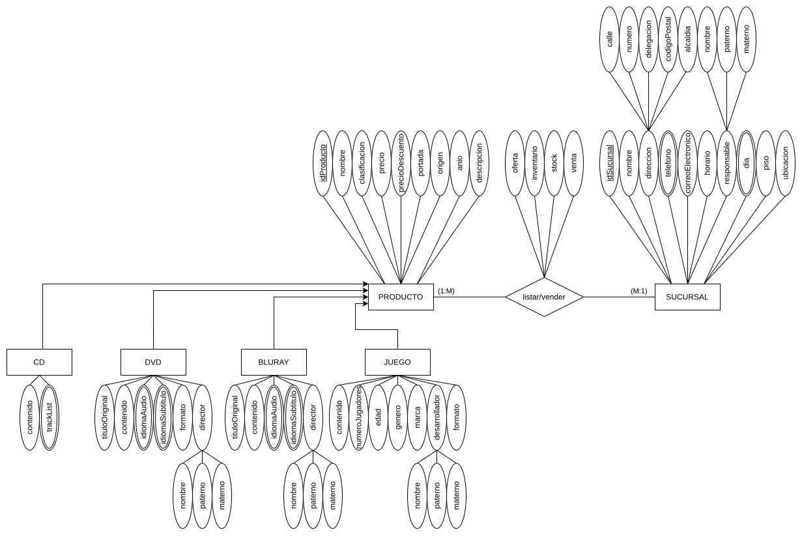
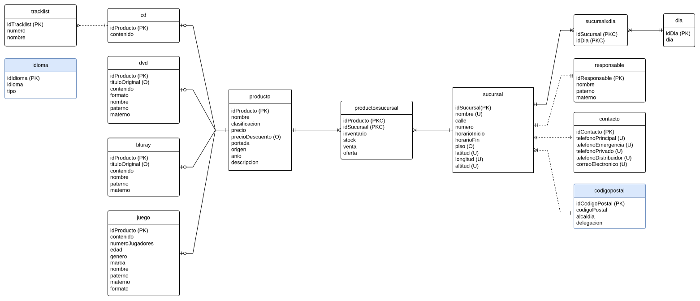
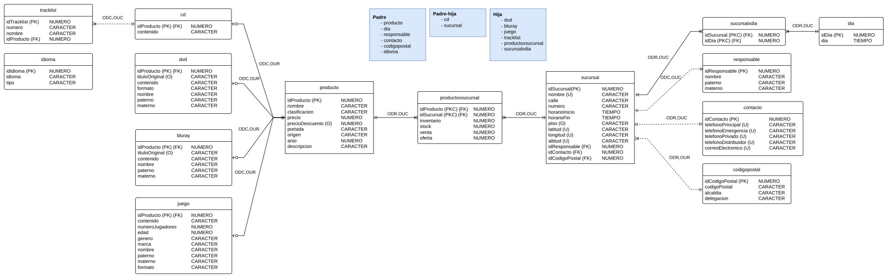

# Inventario MixUp
Inventario MixUp es un proyecto desarrollado en la materia "Diseño de bases de datos relacionales" impartida magistralmente por la maestra Lidia Loreli Zamora Nunfio.

En el proyecto se desarrollo una base de datos relacional para una empresa ficticia llamada MixUp. La cuál necesitaba una base de datos que le permitiera gestionar su inventario de discos (cd, dvd, blu-ray, vynil, etc.), el diseño dio como resultado:

- 📂 Modelo [conceptual](./doc/models/modelado-conceptual.svg), [lógico](./doc/models/modelado-logico.svg) y [físico](./doc/models/modelado-fisico.svg)
- 💻 [Script SQL](./src/inventario-mixup.ipynb) para crear DB, tablas e inserción de datos de prueba 
- 📖 [Diccionario de datos](./doc/diccionario-datos.md)

## Demo

  

## Modelos
| Modelo conceptual | Modelo lógico | Modelo físico |
| --- | --- | --- |
|  |  |  |
